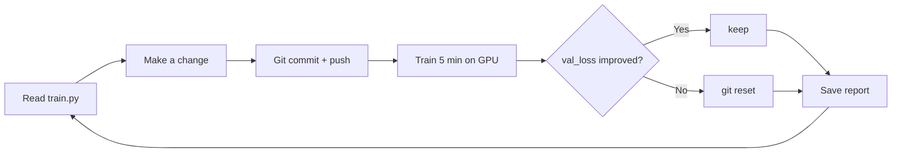

# autoresearch

Autonomous ML research system. An AI agent iterates on `train.py` to minimize `val_loss` (cross-entropy, nats/token) within a fixed 5-minute training budget. Based on [karpathy/autoresearch](https://github.com/karpathy/autoresearch).

**This fork adds:** WandB experiment tracking · Kaggle P100 adapter · per-experiment markdown reports · simplified vanilla GPT + AdamW baseline

---

## How it works



One mutable file — `train.py`. Everything else is fixed. The agent runs forever until you stop it.

---

## Quick start

### Requirements

- Python 3.10+
- [uv](https://docs.astral.sh/uv/) package manager
- NVIDIA GPU (local) **or** a Kaggle account (free P100/T4)
- WandB account (optional, for experiment tracking)

### 1. Clone and configure

```bash
git clone https://github.com/kuncevichandrew2/autoresearch-with-adapters
cd autoresearch-with-adapters

cp .env.example .env
# Edit .env and fill in your keys (see Environment Variables below)
```

### 2. Install dependencies

```bash
# Installs all deps including wandb (requires CUDA GPU on Linux; skip on macOS)
uv sync
```

### 3. Prepare data (one-time, ~5 min)

Downloads training data and trains a BPE tokenizer:

```bash
uv run prepare.py
```

Data is cached in `~/.cache/autoresearch/`. Re-running is safe (skips already downloaded shards).

### 4. Run a single experiment

```bash
uv run train.py
```

Trains for 5 minutes, prints a summary block:

```
---
val_loss:         5.129095
training_seconds: 300.2
total_seconds:    343.0
peak_vram_mb:     6324.1
mfu_percent:      28.03
total_tokens_M:   11.6
num_steps:        355
num_params_M:     16.9
depth:            6
```

### 5. Run the agent (autonomous loop)

Point Claude Code at `program.md`:

```bash
claude  # then: "read program.md and start experimenting"
```

The agent modifies `train.py`, runs training, checks `val_loss`, keeps or reverts, saves a report, and repeats.

---

## Environment variables

Copy `.env.example` to `.env` and fill in:

| Variable | Required | Description |
|----------|----------|-------------|
| `KAGGLE_API_TOKEN` | For Kaggle adapter | From kaggle.com → Settings → API → Create New Token |
| `WANDB_API_KEY` | Optional | From wandb.ai/authorize |
| `WANDB_PROJECT` | Optional | WandB project name (default: `autoresearch`) |

---

## Running on Kaggle (free P100 GPU)

No local GPU? Use the Kaggle adapter.

### Setup (one-time)

1. Fill in `.env` with your `KAGGLE_API_TOKEN` and `WANDB_API_KEY`
2. In `adapters/kaggle/kernel-metadata.json`, set `"id"` to `"<your-kaggle-username>/autoresearch-p100"`
3. Add `WANDB_API_KEY` as a Kaggle Secret: Kaggle → Notebook → Add-ons → Secrets

### Experiment cycle

```bash
# 1. Modify train.py, commit, push to your GitHub branch
git add train.py && git commit -m "expNNN: description"
git push origin autoresearch/mar26

# 2. Push notebook to Kaggle and run
source .env
kaggle kernels push -p adapters/kaggle/

# 3. Poll for completion (~10-15 min total)
for i in $(seq 1 30); do
  STATUS=$(kaggle kernels status <your-username>/autoresearch-p100 2>&1)
  echo "[$(date +%H:%M:%S)] $STATUS"
  echo "$STATUS" | grep -qiE "complete|error|cancel" && break
  sleep 30
done

# 4. Pull and parse results
kaggle kernels output <your-username>/autoresearch-p100 -p /tmp/kout
python3 -c "
import json
events = json.loads(open('/tmp/kout/autoresearch-p100.log').read())
out = ''.join(e['data'] for e in events if e['stream_name']=='stdout')
idx = out.find('---')
print(out[idx:idx+300])
"
```

### P100-specific settings in train.py

```python
DEPTH = 6                  # smaller model = more optimizer steps in 5 min
DEVICE_BATCH_SIZE = 16     # fits in 16GB VRAM
TOTAL_BATCH_SIZE = 2**15   # grad_accum=1, ~355 steps per run
LEARNING_RATE = 1e-3
ADAM_BETAS = (0.9, 0.95)
WARMDOWN_RATIO = 0.2
```

---

## Project structure

```
autoresearch/
├── train.py              # Model + optimizer + training loop  ← AGENT MODIFIES
├── prepare.py            # Data, tokenizer, evaluation        ← READ-ONLY
├── program.md            # Agent instructions                 ← HUMAN EDITS
├── pyproject.toml        # Python dependencies
├── .env.example          # Environment variable template
├── CLAUDE.md             # Agent context (workflow, learnings)
├── reports/              # Per-experiment markdown reports
├── analysis.ipynb        # Result visualization
└── adapters/
    └── kaggle/
        ├── notebook.py         # Kaggle script (clones repo, runs training)
        ├── adapter.py          # Local helper (setup, prepare, train)
        ├── kernel-metadata.json # Kaggle push config
        └── DESCRIPTION.md
```

---

## Model architecture

Vanilla GPT transformer:

- Token embedding → RMS Norm
- N × [CausalSelfAttention (RoPE) + RMS Norm + MLP (GELU) + residuals]
- Final RMS Norm → LM Head

**GPU compatibility:** Flash Attention 3 on SM80+ (H100/A100), PyTorch SDPA fallback on older GPUs (P100/T4/V100). `fp16` + GradScaler on SM < 80, `bfloat16` otherwise. `torch.compile` on SM70+.

---

## WandB integration

Set `WANDB_API_KEY` in `.env`. Per-step metrics logged every 10 steps; final summary logged at end of run.

To disable: leave `WANDB_API_KEY` unset — logging is silently skipped.

---

## Metric: val_loss

Cross-entropy loss in nats/token, evaluated on 100 validation batches after training. Lower is better. Vocab-size-independent.

---

## License

MIT
